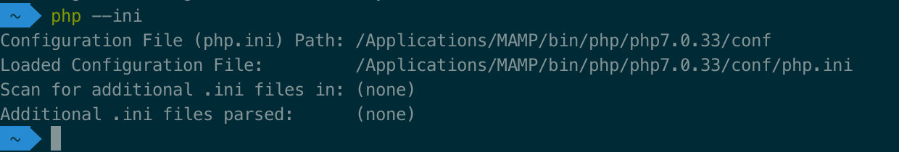
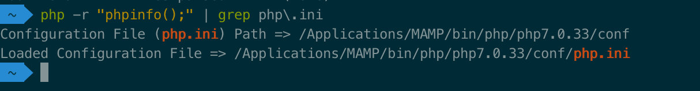
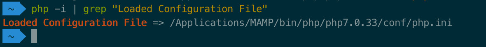
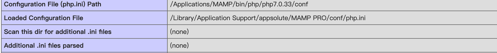

# 安装扩展

## 查找 php.ini 的位置

### Style 1 显示配置文件名

```shell
php --ini
```



### Style 2 命令行打印 phpinfo 查找 关键字 php.ini

```shell
php -r "phpinfo();" | grep php\.ini
```



### Style 3 phpinfo 信息 查找 关键字 Loaded Configuration File

```shell
php -i | grep "Loaded Configuration File"
```



### Style 4 通过浏览器访问 phpinfo() 查看

新建一个 index.php 文件，然后浏览器访问这个文件

```php
<?php
    phpinfo();
```




## 查看 php.ini 文件的参数

```shell
echo '<?php phpinfo();?>' | php 2>&1 | grep -i error_log
```

## 安装 PHP 扩展

以 **Redis** 扩展为例

### Style 1. 编译安装

1. **进入[PHP 扩展仓库](http://pecl.php.net/package/redis) 下载 redis 扩展**

2. **解压安装包**

    ```shell
    tar -xzvf redis-4.3.0.tgz
    ```

    [解压其他格式](compress.md)

3. **通过 phpize 生成编译 configure 配置文件**

    ```shell
    cd redis-4.3.0
    phpize
    ./configure --with-php-config=/Applications/MAMP/bin/php/php5.6.40/bin/php-config
    ```

4. **编译**

    ```shell
    make
    make install
    ```

5. **配置 php.ini 文件**

    ```php
    // 查看php.ini位置
    php -i|grep “Loaded”
    // 打开文件 或者直接编辑该文件
    open /Applications/MAMP/bin/php/php5.6.40/conf/ 
    // 增加扩展
    extension=redis.so
    
    如果使用了MAMP，还需修改MAMP下的php.ini
    添加 extension=redis.so
    ```

### Style 2. PECL 一键安装(自动配置)

1. **安装 pecl**

    如果你的开发环境中，不能识别 `pecl` 命令，先安装 `pecl`。已安装的跳过该步骤。

    ```shell
    # php 版本 > 7
     wget http://pear.php.net/go-pear.phar
     php go-pear.phar
    
    ################################################
    # php 版本 < 7
    yum install php-pear
    
    ################################################
    # Mac 安装 pecl
    # 1. 下载pear
    sudo curl -O http://pear.php.net/go-pear.phar
    # 2. 安装pear
    sudo php -d detect_unicode=0 go-pear.phar
    # 3. 执行以上命令后会进行安装过程，会有一些配置选项
    输入1，回车，配置pear路径为：/usr/local/pear
    输入4，回车，配置命令路径为：/usr/local/bin
    # 4.回车两次，其他让其默认，安装完成
    # 5. 可以通过命令检查pear安装是否成功`pear version`
    ```

2. **配置 pear 的 php_ini**

    注意这里是配置  **<font color="red">pear</font>** 的 php_ini，而不是配置 **<font color="red">pecl</font>** 的 php_ini。

    ```shell
    pear config-set php_ini <ini_path>
    ```

    注意替换<ini_path>为查询到的 php.ini 路径

    配置之后，执行 `pecl install` 会自动向配置文件顶部追加 扩展 extension=example.so

3. **安装扩展**

    ```shell
    sudo pecl install redis
    ```

    安装redis的过程中，会提示询问两个问题，默认答案是no，直接回车即可。安装完毕后，会得到个redis.so文件，以及一个redis.ini。当然，都会自动放置对位置。期间可能会提示权限问题，注意需要对应的扩展目录chmod -R 777一下。

    ​    

​    

​    

